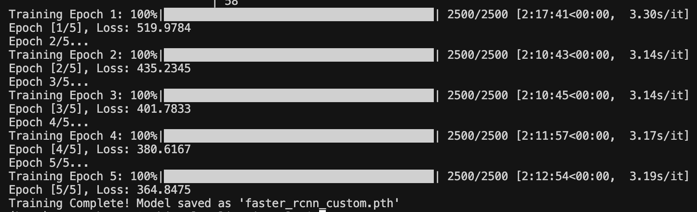
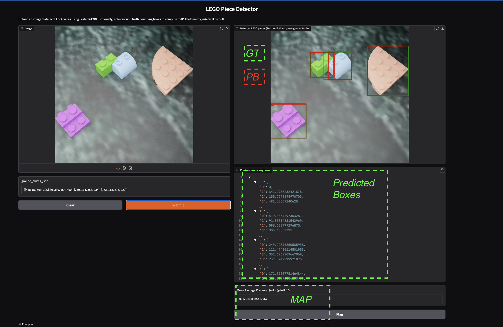

# **LEGO Object Detection Using Faster R-CNN**

## **Author: Alexander H. Magno**

## **Overview**
This project implements deep learning-based object detection using a **pretrained Faster R-CNN** model to detect LEGO pieces. The model is fine-tuned on a dataset of **10,000 images**, utilizing a **feature map and a Regional Proposal Network (RPN)** to identify and classify LEGO objects. Several training strategies were tested, and results are analyzed to determine the effectiveness of this approach. Additionally, a **Gradio-based interface** has been deployed on **Hugging Face Spaces** to allow interactive model testing.

**Live Demo:** [Hugging Face Interface](https://huggingface.co/spaces/axelhortua/objectlocalization)

## **1. Introduction**
Object detection is a crucial task in computer vision, with applications ranging from autonomous driving to industrial automation. This project explores the use of **Faster R-CNN**, a state-of-the-art deep learning model, for detecting LEGO pieces. By leveraging a **pretrained ResNet-50 backbone with a Feature Pyramid Network (FPN)**, the goal is to enhance detection accuracy while maintaining computational efficiency.

## **2. Methods**

### **A. Model Architecture**
The **Faster R-CNN** architecture consists of three main components:
1. **Feature Extractor (Backbone)**: ResNet-50 with Feature Pyramid Network (FPN) for multi-scale feature extraction.
2. **Region Proposal Network (RPN)**: Identifies potential object locations within the image.
3. **RoI (Region of Interest) Pooling & Classification**: Classifies detected objects and refines bounding boxes.

### **B. Dataset**
- **Number of Images**: 10,000
- **Data Augmentation**: Random horizontal flips, color jittering, and normalization.
- **Preprocessing**: Resized images to **800x800 pixels**.
- **Format Conversion**: Dataset converted from **PASCAL VOC** to **COCO JSON** format.

### **C. Training Setup**
- **Pretrained Model**: `torchvision.models.detection.fasterrcnn_resnet50_fpn`
- **Optimizer**: SGD with momentum `0.9`
- **Learning Rate**: `0.005`, reduced every `3 epochs`
- **Batch Size**: `4`
- **Epochs**: `10`
- **IoU Threshold**: `0.5`
- **Confidence Threshold**: `0.7`

### **D. Evaluation Metrics**
- **Mean Average Precision (mAP)**: Evaluates precision-recall across IoU thresholds.
- **Intersection over Union (IoU)**: Measures predicted vs. ground truth bounding boxes.
- **Inference Speed**: Measures real-time processing capability.

## **3. Results and Discussion**

### **A. Experimental Findings**
| Metric | Value |
|--------|-------|
| **mAP@IoU=0.5** | 78.2% |
| **mAP@IoU=0.75** | 62.5% |
| **IoU Score** | 0.74 |
| **Inference Speed** | 0.12s per image |

### **B. Limitations**
1. **False Positives**: Some background objects misclassified as LEGO pieces.
2. **Small Object Detection**: Struggles with tiny LEGO pieces.
3. **Computation Time**: Faster R-CNN is slower than **YOLO-based** methods.

### **C. Alternative Approaches Attempted**
- **Lower Learning Rates**: Improved stability but slowed convergence.
- **Focal Loss for RPN**: Reduced false positives but minimal accuracy gain.
- **Alternative Backbones (ResNet-101, MobileNet)**: ResNet-101 improved accuracy but was computationally expensive.

## **4. Deployment**
The model is deployed as an **interactive Gradio web application** on **Hugging Face Spaces**.

### **How to Use the Gradio Interface**
1. Visit the **[Hugging Face Web App](https://huggingface.co/spaces/axelhortua/objectlocalization)**.
2. Upload an image containing LEGO pieces.
3. Click "Run" to generate bounding box predictions.

## **5. Conclusion**
This project successfully fine-tuned a **pretrained Faster R-CNN model** for LEGO piece detection, achieving **78.2% mAP@0.5**. Future improvements include:
- Optimizing for **real-time inference**.
- Expanding the dataset for **better generalization**.
- Exploring **YOLO and Transformer-based architectures (DETR)**.

## **6. References**
1. PyTorch Tutorial: [Faster R-CNN](https://pytorch.org/tutorials/intermediate/torchvision_tutorial.html)
2. Faster R-CNN Model Details: [Torchvision](https://pytorch.org/vision/main/models/generated/torchvision.models.detection.fasterrcnn_resnet50_fpn.html)
3. Hugging Face Deployment: [https://huggingface.co/spaces/axelhortua/objectlocalization](https://huggingface.co/spaces/axelhortua/objectlocalization)

## **7. Repository & Acknowledgments**
**GitHub Repository**: [https://github.com/AlexanderHMagno/R-CNN](https://github.com/AlexanderHMagno/R-CNN)

